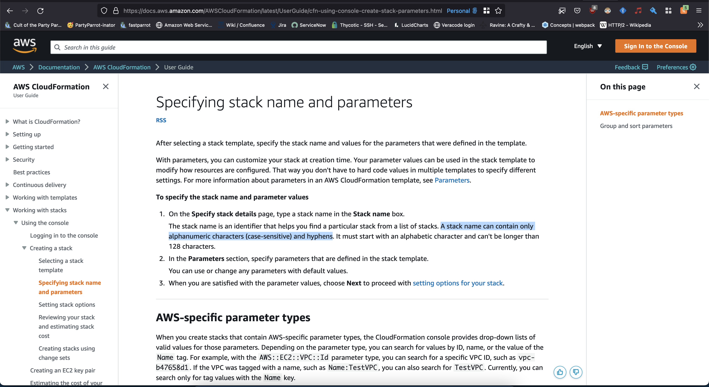

# Troposphere test

- [Troposphere test](#troposphere-test)
  * [Get Started](#get-started)
    + [Requirements:](#requirements-)
    + [Run tests](#run-tests)

Using the latest version 4.1.0 we can run a test and see that troposphere fails to properly
validate stack names, rejecting strings with a `-` character (dash, hyphen, minus). 

This is despite aws stating that stack names absolutely can have this character. 

 - https://docs.aws.amazon.com/AWSCloudFormation/latest/UserGuide/cfn-using-console-create-stack-parameters.html
 - 

 &nbsp;

## Get Started
----

### Requirements:
 - Docker

### Run tests

1. Clone repo
2. Run `./runTest.sh`

&nbsp;
&nbsp;

<small><i><a href='http://ecotrust-canada.github.io/markdown-toc/'>Table of contents generated with markdown-toc</a></i></small>
